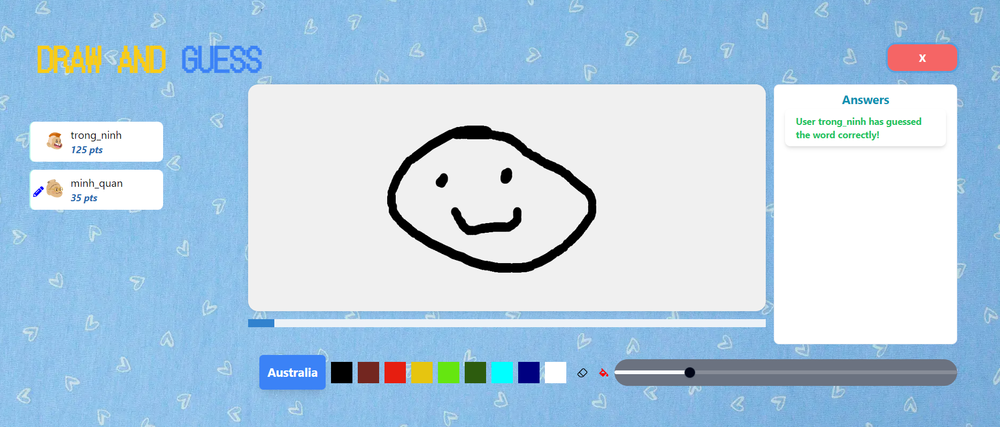
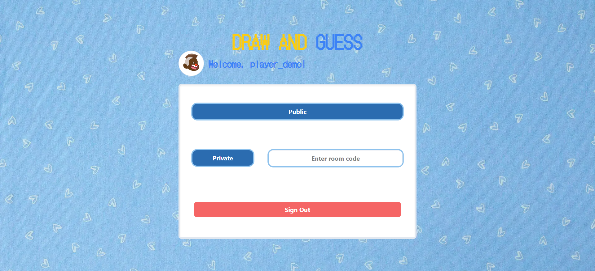
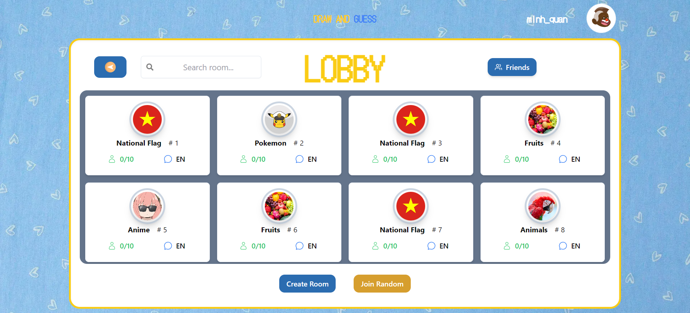

<div align="center">
  
</div>

---

<div align="center">

## 🎨🖼 Draw and guess the words as fast as you can! 🤔✏

</div>

<br/>



---

## Tech Stack

<p align="center">
  &nbsp;&nbsp;&nbsp;
  &nbsp;&nbsp;&nbsp;
  
</p>

---

## Features

- Draw and guess with funny little topics.
- Join or create your own rooms with different customizations.
- Add and invite your friends to play with you!

---

## Installation

Clone the frontend branch from Github

```sh
git clone https://github.com/MinhQuan020903/melodia-music-player.git
```

Install packages:

```sh
npm install
```

Run the application:

```sh
nnpm run dev
```

Clone the backend branch from Github

```sh
git clone https://github.com/MinhQuan020903/DrawAndGuess_Server.git
```

Install Maven dependencies:

```sh
mvn install
```

Run the application:

```sh
mvn spring-boot:run
```

---

# Sites

### Menu



### Lobby



### Game


---

## Contributors

<table align="center">
  <tr>
  <td align="center">
        <a href="https://github.com/MinhQuan020903">
            
            <br />
            <sub>
                <b>Do Mai Minh Quan</b>
            </sub>
        </a>
        <br />
        </a> 
    </td>
    <td align="center">
        <a href="https://github.com/TinSpaghettiCode">
            
            <br />
            <sub>
                <b>Nguyen Ngoc Tin</b>
            </sub>
        </a>
        <br />
        </a> 
    </td>

  <td align="center">
        <a href="https://github.com/Ninhnon">
            
            <br />
            <sub>
                <b>Nguyen Trong Ninh</b>
            </sub>
        </a>
        <br />
        </a> 
    </td>
    <td align="center">
        <a href="https://github.com/petrichor-hl">
            
            <br />
            <sub>
                <b>Tran Le Hoang Lam</b>
            </sub>
        </a>
        <br />
        </a> 
    </td>

  </tr>
</table>
